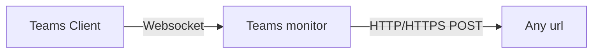

# Teams monitor

[![Check my blog][badge_source]][link_source] [![Check my blog][badge_issues]][link_issues] [![Check my blog][badge_blog]][link_blog]

A simple command line application that connects to the local Teams API and forwards the meeting status to any endpoint (you manage).

Sending the status from your Teams client to any website is a matter of three steps:

1. Install the tool `dotnet install SvRooij.TeamsMonitor`
2. (optional) Set the Team token in environment `TEAMS_TOKEN`
3. Run the tool `teams-monitor {teams-token-here} --webhook {url-here}`

## What does Teams Monitor do?

It [connects](#teams-has-a-local-api) to Teams and allows you to send the realtime data from your Teams client to any server.



If you run this tool with a webhook specified, the webhook will receive a HTTP POST message with the following JSON payload:

```json
{
    "meetingState": {
        "isMuted": false,
        "isCameraOn": true,
        "isHandRaised": false,
        "isInMeeting": false,
        "isRecordingOn": false,
        "isBackgroundBlurred": false
    },
    "meetingPermissions": {
        "canToggleMute": false,
        "canToggleVideo": true,
        "canToggleHand": false,
        "canToggleBlur": false,
        "canToggleRecord": false,
        "canLeave": false,
        "canReact": false
    }
}
```

## Meeting light for your home office

I've been working from home a lot lately, and I always wanted to control the light in the hallway to turn another color when I'm in a meeting. I was doing this with a button on my desk and forgot to switch it approximately fifty percent of the time.

[](https://home-assistant.io)

I'm a big fan of [Home Assistant](https://home-assistant.io), it helps me automate everything around that house. So let's configure home assistant to change the color of the lights in the hallway

### Home assistant - Step 1

Create a **toggle helper** for the user you want to monitor. These are hidden under `Settings` -> `Devices & Services` -> `Helpers`, pick a name that makes sense like `{name} Meeting`.


### Home assistant - Step 2

Create a new blank automation and use the **webhook trigger**. `Settings` -> `Automations & Scenes` -> `Create Automation`.

Add a **Webhook trigger**. This wil generate a new webhook url that looks like `https://{your-ha-domain}/api/webhook/{some-complicated-string}` and this should be kept **secret**!

Add an action, pick the `If-Then` and add a **template condition**.
The template should be `{{trigger.json.meetingState.isInMeeting}}` with the brackets!

In the **then** section you should add a **Call Service** action that calls `input_boolean: Turn On` and be sure to select your helper from step 1

Press the **Add else** link and add a **Call Service** action that does the reverse `input_boolean: Turn Off`.


### Home assistant - Step 3

Copy the webhook url from the automation you just created and use that to start the Teams Monitor

`teams-monitor {teams-api-token} --webhook {webhook-url}`

If you want to make it easier on yourself, you can also save both values in the environment settings

- `TEAMS_TOKEN` Teams token copied from the External api under privacy.
- `TEAMS_WEBHOOK` Url copied from Home Assistant.

### Home assistant - Step 4

You now have a toggle helper that changes automatically when you're in a meeting. You can create an addition automation that does something when the toggle changes state. By connecting the automation to the toggle and not to the webhook, you can also manually trigger the same actions.


## Teams has a local api?

Yes, it does! If you never heard of it, that might be right because it was released February 1st 2023. Once you [enable](https://support.microsoft.com/en-us/office/connect-third-party-devices-to-teams-aabca9f2-47bb-407f-9f9b-81a104a883d6) it, you get a local api token.

I'm not explaining what the api looks like, as [Martijn Smit](https://lostdomain.notion.site/Microsoft-Teams-WebSocket-API-5c042838bc3e4731bdfe679e864ab52a) already did that. For now you just need to know, if you enable the local api your Teams client will open a websocket server at localhost post `8124`.

You can just use any client that supports websockets and connect to the following url.

`ws://localhost:8124?token=API-TOKEN-FROM-PRIVACY&protocol-version=1.0.0&manufacturer=MuteDeck&device=MuteDeck&app=MuteDeck&app-version=1.4`

If something changes to your meeting status (or any of the other values), you'll get a JSON encoded message on the open websocket connection that looks like:

```json
{
    "apiVersion": "1.0.0",
    "meetingUpdate": {
        "meetingState": {
            "isMuted": false,
            "isCameraOn": true,
            "isHandRaised": false,
            "isInMeeting": false,
            "isRecordingOn": false,
            "isBackgroundBlurred": false
        },
        "meetingPermissions": {
            "canToggleMute": false,
            "canToggleVideo": true,
            "canToggleHand": false,
            "canToggleBlur": false,
            "canToggleRecord": false,
            "canLeave": false,
            "canReact": false
        }
    }
}
```

## Socials

[![LinkedIn Profile][badge_linkedin]][link_linkedin]
[![Link Mastodon][badge_mastodon]][link_mastodon]
[![Follow on Twitter][badge_twitter]][link_twitter]
[![Check my blog][badge_blog]][link_blog]

If you like my Teams Monitor, please give me a shout out on any of these platforms.

[badge_issues]: https://img.shields.io/github/issues/svrooij/teams-monitor?style=for-the-badge&logo=github
[badge_source]: https://img.shields.io/badge/source-svrooij%2Fteams--monitor-blue?style=for-the-badge&logo=github
[link_issues]: https://github.com/svrooij/teams-monitor/issues
[link_source]: https://github.com/svrooij/teams-monitor

[badge_blog]: https://img.shields.io/badge/blog-svrooij.io-blue?style=for-the-badge
[badge_linkedin]: https://img.shields.io/badge/LinkedIn-stephanvanrooij-blue?style=for-the-badge&logo=linkedin
[badge_mastodon]: https://img.shields.io/mastodon/follow/109502876771613420?domain=https%3A%2F%2Fdotnet.social&label=%40svrooij%40dotnet.social&logo=mastodon&logoColor=white&style=for-the-badge
[badge_twitter]: https://img.shields.io/badge/follow-%40svrooij-1DA1F2?logo=twitter&style=for-the-badge&logoColor=white
[link_blog]: https://svrooij.io/
[link_linkedin]: https://www.linkedin.com/in/stephanvanrooij
[link_mastodon]: https://dotnet.social/@svrooij
[link_twitter]: https://twitter.com/svrooij