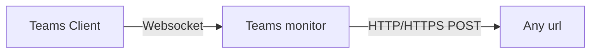

# Teams monitor

 [![Nuget badge][badge_nuget]][link_nuget]
 [![Number of github stars][badge_stars]][link_source]
 [![Number of github issues][badge_issues]][link_issues]
 [![Source on github][badge_source]][link_source]

 [![GitHub Sponsors][badge_sponsor]][link_sponsor]
 [![Check my blog][badge_blog]][link_blog]

A simple command line application that connects to the local Teams API and forwards the meeting status to any endpoint (you manage).

Sending the status from your Teams client to any website is a matter of three steps:

1. Install the tool `dotnet tool install --global SvRooij.TeamsMonitor`
2. Run the tool `teams-monitor --webhook {url-here}`
3. Join a test meeting to trigger the pairing process

This app needs either `.NET6` or `.NET7` or `.NET8` installed on your machine.

## Library available

There also is a [library](https://github.com/svrooij/teams-monitor/blob/main/LIBRARY.md) available, if you want to use this in your own application.

## What does Teams Monitor do?

It [connects](#teams-has-a-local-api) to Teams and allows you to send the realtime data from your Teams client to any server (flowchart only displays at github).



If you run this tool with a webhook specified, the webhook will receive a HTTP POST message with the following JSON payload:

```json
{
  "meetingUpdate": {
    "meetingState": {
      "isMuted": false,
      "isVideoOn": false,
      "isHandRaised": false,
      "isInMeeting": false,
      "isRecordingOn": false,
      "isBackgroundBlurred": false,
      "isSharing": false,
      "hasUnreadMessages": false
    },
    "meetingPermissions": {
      "canToggleMute": false,
      "canToggleVideo": false,
      "canToggleHand": false,
      "canToggleBlur": false,
      "canLeave": false,
      "canReact": false,
      "canToggleShareTray": false,
      "canToggleChat": false,
      "canStopSharing": false,
      "canPair": false
    }
  }
}
```

## Meeting light for your home office

I've been working from home a lot lately, and I always wanted to control the light in the hallway to turn another color when I'm in a meeting. I was doing this with a button on my desk and forgot to switch it approximately fifty percent of the time.

[](https://home-assistant.io)

I'm a big fan of [Home Assistant](https://home-assistant.io), it helps me automate everything around that house. So let's configure home assistant to change the color of the lights in the hallway

### Home assistant - Step 1

Create a **toggle helper** for the user you want to monitor. These are hidden under `Settings` -> `Devices & Services` -> `Helpers`, pick a name that makes sense like `{name} Meeting`.


### Home assistant - Step 2

Create a new blank automation and use the **webhook trigger**. `Settings` -> `Automations & Scenes` -> `Create Automation`.

Add a **Webhook trigger**. This wil generate a new webhook url that looks like `https://{your-ha-domain}/api/webhook/{some-complicated-string}` and this should be kept **secret**!

Add an action, pick the `If-Then` and add a **template condition**.
The template should be `{{trigger.json.meetingState.isInMeeting}}` with the brackets!

In the **then** section you should add a **Call Service** action that calls `input_boolean: Turn On` and be sure to select your helper from step 1

Press the **Add else** link and add a **Call Service** action that does the reverse `input_boolean: Turn Off`.


### Home assistant - Step 3

Copy the webhook url from the automation you just created and use that to start the Teams Monitor

`teams-monitor --webhook {webhook-url}`

If you want to make it easier on yourself, you can also save the webhook in the environment settings

- `TEAMS_WEBHOOK` Url copied from Home Assistant.

### Home assistant - Step 4

You now have a toggle helper that changes automatically when you're in a meeting. You can create an addition automation that does something when the toggle changes state. By connecting the automation to the toggle and not to the webhook, you can also manually trigger the same actions.


## Teams has a local api?

Yes, it does! If you never heard of it, that might be right because it was released February 1st 2023. Once you [enable](https://support.microsoft.com/office/connect-third-party-devices-to-teams-aabca9f2-47bb-407f-9f9b-81a104a883d6?wt.mc_id=SEC-MVP-5004985) it, ~~you get a local api token.~~ Teams opens up a local websocket server that you can connect to using your client of choice.

`ws://localhost:8124?token=61e9d3d4-dbd6-425d-b80f-8110f48f769c&protocol-version=2.0.0&manufacturer=YourManufacturer&device=YourDevice&app=YourApp&app-version=2.0.26`

At first you have limited access, and once the user goes into a meeting you'll see a message like:

```json
{
  "meetingUpdate": {
    "meetingPermissions": {
      "canToggleMute": true,
      "canToggleVideo": true,
      "canToggleHand": true,
      "canToggleBlur": false,
      "canLeave": true,
      "canReact": true,
      "canToggleShareTray": true,
      "canToggleChat": true,
      "canStopSharing": false,
      "canPair": true
    }
  }
}
```

If `canPair` is `true`, it means the user is in a meeting and you can send any [available command](#commands-available) to trigger the pairing message in Teams and your app will get a new token for the next connection. If seeing if the user is an a meeting is enough for your use case, you can skip the pairing process and just use `canPair` as an indication whether the user is in a meeting.

### Messages send by Teams

Currently it seems there are several messages that you might receive:

#### Meeting update

After pairing, you will get messages like these:

```json
{
  "meetingUpdate": {
    "meetingState": {
      "isMuted": false,
      "isVideoOn": false,
      "isHandRaised": false,
      "isInMeeting": false,
      "isRecordingOn": false,
      "isBackgroundBlurred": false,
      "isSharing": false,
      "hasUnreadMessages": false
    },
    "meetingPermissions": {
      "canToggleMute": false,
      "canToggleVideo": false,
      "canToggleHand": false,
      "canToggleBlur": false,
      "canLeave": false,
      "canReact": false,
      "canToggleShareTray": false,
      "canToggleChat": false,
      "canStopSharing": false,
      "canPair": false
    }
  }
}
```

#### Service response

Pairing failed

```json
{"requestId":1,"response":"Pairing response resulted in no action"}
```

Your service request complete successfully

```json
{"requestId":2,"response":"Success"}
```

#### Token update

```json
{"tokenRefresh":"61e9d3d4-dbd6-425d-b80f-8110f48f769c"}
```

### Commands available

You can send several commands to the websocket server, but they will only be accepted if you completed the pairing process.

Each command has a `requestId` that you can use to match the response to the request. It seems to be an incrementing number, but I'm not sure if you can re-used them on the same connection.

```json
{ "action":"some-action","parameters":{},"requestId":1 }
```

#### Send a reaction

You can send several reactions to teams. The once tested: `like`, `love`, `applause`, `wow`, `laugh`

```json
{
  "action": "send-reaction",
  "parameters": {
    "type": "like"
  },
  "requestId": 1
}
```

#### Toggle background blur

```json
{"action":"toggle-background-blur","parameters":{},"requestId":1}
```

#### Toggle Video
  
```json
{"action":"toggle-video","parameters":{},"requestId":1}
```

#### Toggle Mute

```json
{"action":"toggle-mute","parameters":{},"requestId":1}
```

#### Toggle Hand

```json
{"action":"toggle-hand","parameters":{},"requestId":1}
```

#### Leave call

```json
{"action":"leave-call","parameters":{},"requestId":2}
```

## Socials

[![LinkedIn Profile][badge_linkedin]][link_linkedin]
[![Link Mastodon][badge_mastodon]][link_mastodon]
[![Follow on Twitter][badge_twitter]][link_twitter]
[![Check my blog][badge_blog]][link_blog]
[![Number of github stars][badge_stars]][link_source]

If you like my Teams Monitor, please give me a shout out on any of these platforms.

[badge_issues]: https://img.shields.io/github/issues/svrooij/teams-monitor?style=for-the-badge&logo=github
[badge_nuget]: https://img.shields.io/nuget/v/SvRooij.TeamsMonitor?logo=nuget&style=for-the-badge
[badge_source]: https://img.shields.io/badge/source-svrooij%2Fteams--monitor-blue?style=for-the-badge&logo=github
[badge_sponsor]: https://img.shields.io/github/sponsors/svrooij?label=Github%20Sponsors&style=for-the-badge&logo=github
[badge_stars]: https://img.shields.io/github/stars/svrooij/teams-monitor?style=for-the-badge&logo=github
[link_issues]: https://github.com/svrooij/teams-monitor/issues
[link_nuget]: https://www.nuget.org/packages/svrooij.teamsmonitor
[link_source]: https://github.com/svrooij/teams-monitor
[link_sponsor]: https://github.com/sponsors/svrooij/

[badge_blog]: https://img.shields.io/badge/blog-svrooij.io-blue?style=for-the-badge
[badge_linkedin]: https://img.shields.io/badge/LinkedIn-stephanvanrooij-blue?style=for-the-badge&logo=linkedin
[badge_mastodon]: https://img.shields.io/mastodon/follow/109502876771613420?domain=https%3A%2F%2Fdotnet.social&label=%40svrooij%40dotnet.social&logo=mastodon&logoColor=white&style=for-the-badge
[badge_twitter]: https://img.shields.io/badge/follow-%40svrooij-1DA1F2?logo=twitter&style=for-the-badge&logoColor=white
[link_blog]: https://svrooij.io/
[link_linkedin]: https://www.linkedin.com/in/stephanvanrooij
[link_mastodon]: https://dotnet.social/@svrooij
[link_twitter]: https://twitter.com/svrooij
